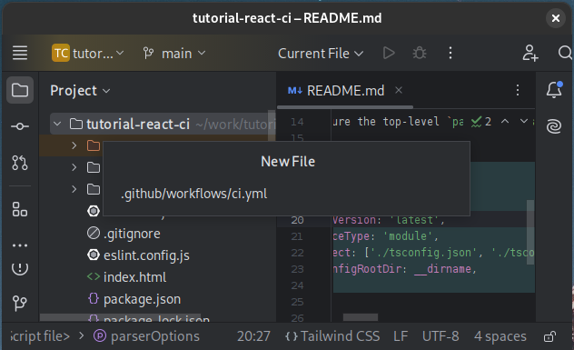
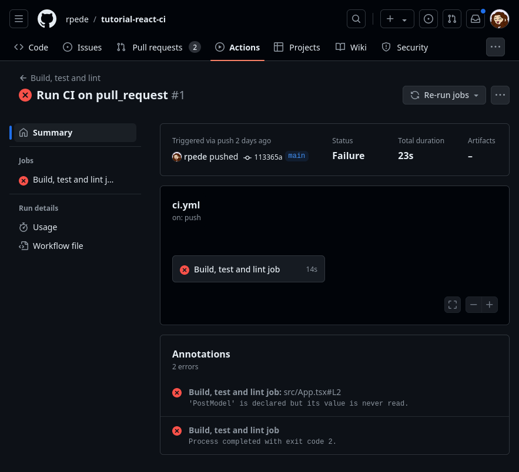
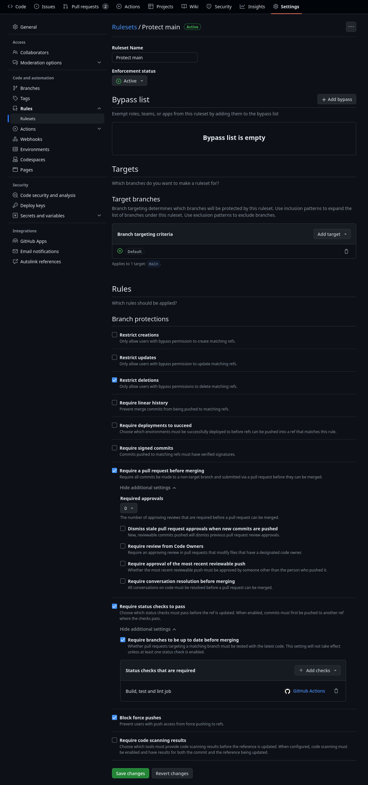

# React CI Tutorial

This tutorial will let you build a Continuous Integration (CI) workflow for
frontend app using React.
The resulting setup will be suitable for [GitHub Flow](https://githubflow.github.io/).

This repository contains the application code you will build the CI workflow
around.
The sample application in this repository is written in TypeScript and uses Vite
to build.

In this tutorial you will:

- Create a workflow from your IDE
- Add steps to install dependencies, build, lint, test
- Use an action to show test coverage report on pull-requests
- Add branch protection

## Getting started

1. Click on the green "Use this template" button at the top
2. Then select "Create a new repository"


3. Click "Create repository from template"
4. Clone the repository following the instructions [here](https://docs.github.com/en/repositories/creating-and-managing-repositories/cloning-a-repository)
5. Open your local clone in WebStorm or another editor

## Initial workflow

To start things off, let's create a new workflow.

Create a new file `.github/workflows/ci.yml` by right-clicking on project folder
in **Project** panel.
Then _New_ -> _File_ and type the path.



Add the following content:

```yml
name: Build, test and lint
on:
  push:
    branches: ["main"]
  pull_request:
    types: [opened, synchronize, reopened, closed]
    branches: ["main"]
jobs:
  frontend_build_lint_test_job:
    runs-on: ubuntu-latest
    name: Build, lint and test job
    steps:
      - name: Hello world
        run: echo "Hello world"
```

The YAML code is just a simple skeleton workflow with a single step that outputs
"Hello world".

The workflow will execute on push and pull-requests to **main** branch.

For now, we will commit directly to **main** branch.
Later on, branch protection will be added such that changes to **main** can only
happen via pull-requests.

In the terminal do:

```sh
git add .github
git diff --cached
# review you changes
git commit -m 'Add ci workflow skeleton'
git push
```

Head over to the repository on GitHub and go to the "Actions" tab.
Observe the workflow execute.

You can also try to make a pull-requests which should also trigger the workflow.

**TODO** screenshot

## 1. Dependencies

Before we can do anything useful in the workflow we need to install the
dependencies for the project.

### Dependency resolution

Dependencies are defined in `package.json`.
Dependencies are resolved to exact version using
[semantic versioning](https://docs.npmjs.com/about-semantic-versioning) rules.

If a dependency has a version `3.2.1` then follows:

| Number | Meaning       | Compatibility                             |
| ------ | ------------- | ----------------------------------------- |
| `3`    | Major release | Changes that break backward compatibility |
| `2`    | Minor release | Backward compatible new features          |
| `1`    | Patch release | Backward compatible bug fixes             |

Dependencies are often specified as `^1.1.0`, meaning latest release without
breaking changes that are equal to or newer than the specified version.

Whe you run `npm install` it will attempt to resolve and install compatible
version of all dependencies including dependencies of dependencies.

The exact dependencies and all versions are stored in `package-lock.json`.

Installing dependencies with `npm clean-install` will make sure only the exact
versions of dependencies specified in `package-lock.json` is installed.

Using `npm clean-install` allows two builds on the same commit to produce the
same output.
Meaning we have version control of our build output without storing it.

### Change workflow

In your `ci.yml`, replace:

```yml
- name: Hello world
  run: echo "Hello world"
```

With:

```yml
- uses: actions/checkout@v4
- uses: actions/setup-node@v4
  with:
    node-version: "22"
- name: Install dependencies
  run: npm clean-install
```

_NOTE: make sure the snippet is correctly indented._

The `actions/checkout` action will checkout the commit for which the workflows run.

`actions/setup-node` makes the specified version of node.js (including npm)
available.

Commit and push your changes to make sure it works.

## 2. Build

Let's modify the workflow to do something actually useful.

Here we will have it transpile (aka build) the TypeScript source code of the
application to JavaScript.

If it can't even build the code, it means that someone definitely screwed up and
we would like to know as early as possible.

Just add the following step to `ci.yml`:

```yml
- name: Build
  run: npm run build
```

Commit and push to see it in action.



Oh snap, the build is broken.

Create a feature branch and see if you can fix it.
Here are the GIT commands:

```sh
git checkout -b fix/build
# Look closely at the workflow output.
# Can you find and fix the error?
git add -A
git diff --cached
# Review your staged changes.
git commit -m 'Write a helpful commit message'
git push
# Make sure you are back on main branch afterwards
git checkout main
```

*NOTE: lines starting with # are comments, not commands.*

Create and merge a pull-requests from `fix/build` branch.
Verify that you fixed the build. If not, commit another change to same branch.
You can merge the pull-request once you've fixed the issue.

## 3. Lint

Let's expand a bit and make sure the code is also up to standard.
We can do that with [eslint](https://eslint.org/).

**eslint** is something called a [linter](<https://en.wikipedia.org/wiki/Lint_(software)>).
Linters are tools that can analyze source code for potential errors.
They can also enforce stylistic rules for the source code to make sure the
coding style is uniform, at least on the semantic level.

### Modify the project

To use it, we first need to add it to the project configuration.
Luckily there is a tool that automates most of it.

In a terminal, do:

```sh
npm init @eslint/config@latest
```

It will ask you a bunch of questions about your project.

Accept the defaults, **except when asked if the project uses TypeScript**.

Answers/expected output.

```
> tutorial-react-ci@0.0.0 npx
> create-config

@eslint/create-config: v1.1.5

✔ How would you like to use ESLint? · problems
✔ What type of modules does your project use? · esm
✔ Which framework does your project use? · react
✔ The React plugin doesn't officially support ESLint v9 yet. What would you like to do? · 9.x
✔ Does your project use TypeScript? · typescript
✔ Where does your code run? · browser
The config that you've selected requires the following dependencies:

eslint@9.x, globals, @eslint/js, typescript-eslint, eslint-plugin-react, @eslint/compat
✔ Would you like to install them now? · No / Yes
✔ Which package manager do you want to use? · npm
☕️Installing...
```

Unfortunately, there are a couple of small things that need fixing.

In your `package.json` just about `dependencies`, add:

```json
  "overrides": {
    "eslint": "^9.6.0"
  },
```

Then in the `script` section, change:

```json
    "lint": "eslint . --ext ts,tsx --report-unused-disable-directives --max-warnings 0",
```

To:

```json
    "lint": "ESLINT_USE_FLAT_CONFIG=false eslint . --ext ts,tsx --report-unused-disable-directives --max-warnings 0",
```

_NOTE above might change when ESLint 9 is fully supported._

## Change workflow

Simply add the following to `ci.yml`:

```yml
- name: Lint
  run: npm run lint
```

*NOTE: make sure it indentation is correct.*

Commit and push!

Oh, no. Another failure.

Can you fix it?

Create another feature branch with your fix using same procedure as before.

## 4. Test

You can only do so much with static code analysis.
It can't tell if the code actually do what it is supposed to.
We need to execute the code for that.

For that we need to write tests.
Luckily, the sample app already has some tests.
So, let's execute them as part of the workflow.

### Modify the project

[Vite.js](https://vitejs.dev/) is used to build the app and there is a testing
framework for it called [Vitest](https://vitest.dev/) that we will use.

We can install it with:

```sh
npm install -D vitest
```

Then add the following under `scripts` in `package.json`:

```json
    "test": "vitest",
```

It allows you to run the tests with the `npm run test` command.

### Change workflow

Simply add the following to `ci.yml`:

```yml
- name: Lint
  run: npm run test
```

*NOTE: make sure it indentation is correct.*

Commit and push!

Again, we have a failing workflow.

See if you can fix it!

_Hint: look at `src/api.test.ts`_

## 5. Test coverage

Generally, each test only tests part of the application code.
So, how can you tell if the tests have covered enough of the application code?

To answer that question, we need to generate a coverage report.
It can tell you what lines of your application was executed by the tests and
summarize it into a percentage.

Output looks like this:

| Status | Category   | Percentage | Covered / Total |
| :----: | ---------- | ---------: | --------------: |
|   🔵   | Lines      |     21.87% |        28 / 128 |
|   🔵   | Statements |     21.87% |        28 / 128 |
|   🔵   | Functions  |     14.28% |           1 / 7 |
|   🔵   | Branches   |     14.28% |           1 / 7 |

Actually, we get a couple of different numbers.
Here is a quick explanation.

<dl>
<dt>Lines</dt>
<dd>Should be self-explanatory</dd>
<dt>Statements</dt>
<dd>They end with a `;`</dd>
<dt>Functions</dt>
<dd>Also, what it sounds like. Covers methods as well.</dd>
<dt>Branches</dt>
<dd>Whenever the code can take different code paths, like when you have an `if` and `else`.</dd>
</dl>

### Modify the project

The generation of coverage reports can fairly easily be enabled with **Vitest**.

First install a package to support it.

```sh
npm i -D @vitest/coverage-v8
```

Next, change `vite.config.js` to:

```js
/// <reference types="vitest" />
import { defineConfig } from "vite";
import react from "@vitejs/plugin-react";

// https://vitejs.dev/config/
export default defineConfig({
  plugins: [react()],
  test: {
    coverage: {
      // you can include other reporters, but 'json-summary' is required, json is recommended
      reporter: ["text", "json-summary", "json"],
      // If you want a coverage reports even if your tests are failing, include the reportOnFailure option
      reportOnFailure: true,
    },
  },
});
```

Basically, it tells Vite+Vitest to generate a report and a summery in JSON
format and output a report even if there is a failure.

Create an alias for running tests with coverage report by adding the following
to `script` section of `package.json`:

```json
    "test:coverage": "vitest --run --coverage.enabled true",
```

The report will be saved to a file in the `coverage` folder.
We don't need to commit the reports since they are generated from the code.
Therefore, you should append `coverage` on a new line in the `.gitignore` file.

**TODO** screenshot

### Change workflow

Wouldn't it be cool if it showed the coverage when reviewing a pull-request for
a feature branch?

We can get the workflow to automatically make a comment with the coverage on
pull-requests.
To make it happen we need to add two things.
First permissions to make the comment.
Second, we will use the [davelosert/vitest-coverage-report-action]() action to post it.

In `.github/workflows/ci.yml`, after:

```yml
frontend_build_test_and_lint_job:
  runs-on: ubuntu-latest
```

You must add the following:

```yml
permissions:
  # Required to checkout the code
  contents: read
  # Required to put a comment into the pull-request
  pull-requests: write
```

Then change the **Test** step between **Build** and **Lint** to:

```yml
- name: Test
  run: npm run test:coverage
- name: Report Coverage
  # Set if: always() to also generate the report if tests are failing
  # Only works if you set `reportOnFailure: true` in your vite config as specified above
  if: always()
  uses: davelosert/vitest-coverage-report-action@v2
  with:
    json-summary-path: "./coverage/coverage-summary.json"
    json-final-path: "./coverage/coverage-final.json"
```

Stage the files and make sure the `coverage` folder isn't included.
Then commit and push.

What are the coverage percentage?

## 6. Branch protection

Navigate to the "Settings".
Click "Rules" then "Rulesets" in the left panel.
Click the green "New ruleset" button.

Configure as shown in the screenshot.



Click "Save changes".

Now all changes to the **main** branch have to be done with a pull-request.
The pull-request can't be merged before the CI workflow we build have succeeded.

You can take it one step further and require the pull-request to have been
approved by other team members or the code owner before it can be merged.

## Closing thoughts

You have now build a reasonable CI workflow for a React frontend application.

The general concepts applies for other tech-stacks as well, but the way it is
set up will be different.

It is common to also have a workflow to automate deploying the application.
That will be an exercise for later.

[Here](https://gist.github.com/rpede/d9ceade1eca00e4b3bc46141693648e2) are the
main files that we changes, just for reference.
